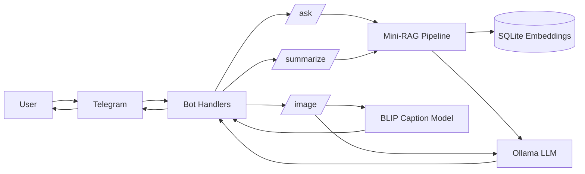

# Telegram Mini-RAG + Vision Bot

Production-ready Telegram bot with:
- `/ask <query>`: document Q&A via Mini-RAG + local LLM
- `/summarize [topic]`: summarize indexed local docs
- `/image`: image caption + 3 tags
- `/help`: command guide

---

## Architecture



### Request flow

- **`/ask`**
  - Query embedding (`all-MiniLM-L6-v2`)
  - Top-K chunk retrieval from SQLite-backed embedding index
  - LLM answer generation
  - Source attribution appended: `Source: <doc1.md>, <doc2.md>`
- **`/summarize`**
  - No topic: broad summary across docs
  - With topic: retrieve topic-relevant chunks then summarize
- **`/image`**
  - Telegram photo downloaded
  - BLIP caption generation (`image-text-to-text` pipeline)
  - LLM generates 3 tags (heuristic fallback if LLM fails)

---

## Project Structure

```text
app.py
bot/
  handlers.py
rag/
  rag_pipeline.py
vision/
  caption.py
utils/
  config.py
  llm.py
data/
  docs/
  embeddings.sqlite3    # generated at runtime
models/                 # optional local vision model folder
README.md
requirements.txt
```

---

## Models Used

### Text Embeddings (RAG)
- **Default:** `sentence-transformers/all-MiniLM-L6-v2`
- **Used for:** chunk embeddings + query embeddings
- **Configured by:** `EMBEDDING_MODEL_NAME`

### LLM (answers + tags + summaries)
- **Provider:** Ollama HTTP API
- **Default model env value:** `OLLAMA_MODEL=llama3` (set to any installed model, e.g. `llama3.2:latest`)
- **Endpoints used:** `/api/chat`, fallback `/api/generate`
- **Configured by:** `OLLAMA_BASE_URL`, `OLLAMA_MODEL`, `OLLAMA_TEMPERATURE`, `OLLAMA_NUM_PREDICT`

### Vision Captioning
- **Default model:** `Salesforce/blip-image-captioning-base`
- **Task API used:** `image-text-to-text`
- **Configured by:** `VISION_MODEL_NAME` (HF repo id or local folder path)

---

## Exact Run Steps

### 1) Prerequisites
- Python `3.10+`
- Telegram bot token from BotFather
- Ollama installed and running

### 2) Install dependencies

```bash
cd /home/waseem/Desktop/assignment
python -m venv .venv
source .venv/bin/activate
pip install -r requirements.txt
```

### 3) Configure `.env`

Create/update `.env` in project root:

```env
BOT_TOKEN="YOUR_TELEGRAM_BOT_TOKEN"
LOG_LEVEL="INFO"

EMBEDDING_MODEL_NAME="sentence-transformers/all-MiniLM-L6-v2"
CHUNK_SIZE_WORDS="180"
CHUNK_OVERLAP_WORDS="40"
RAG_TOP_K="3"

OLLAMA_BASE_URL="http://localhost:11434"
OLLAMA_MODEL="llama3.2:latest"
OLLAMA_TEMPERATURE="0.2"
OLLAMA_NUM_PREDICT="256"

# Either HF id or local model folder
VISION_MODEL_NAME="models/blip-image-captioning-base"
```

### 4) Ensure Ollama is running and model exists

```bash
ollama serve
```

In another terminal:

```bash
ollama pull llama3.2:latest
curl -i http://localhost:11434/api/tags
```

### 5) Add documents for RAG

Place `.txt` / `.md` files into:

```text
data/docs/
```

### 6) Run the bot

```bash
python app.py
```

Startup does:
- validate/load settings
- verify Ollama model availability (auto-pulls if missing and CLI is available)
- build/load RAG embedding index
- start Telegram polling

---

## Commands

- `/start`
  - greeting + capability summary
- `/help`
  - command reference
- `/ask <query>`
  - question answering over indexed docs
  - includes explicit source attribution
- `/summarize`
  - broad summary of indexed docs
- `/summarize <topic>`
  - topic-focused summary
- `/image`
  - enters image-wait mode; next photo gets captioned
  - optional Telegram photo caption is passed as text prompt

---

## Sample Outputs

### `/ask What does this bot do?`

```text
This bot supports document Q&A with Mini-RAG, document summarization, and image captioning with tag generation.
It retrieves relevant chunks from local docs and uses a local LLM to answer concisely.

Source: 01_overview.md, 02_chunking.md
```

### `/summarize chunking strategy`

```text
- The system splits documents using a word-based chunking method.
- CHUNK_SIZE_WORDS controls chunk length.
- CHUNK_OVERLAP_WORDS keeps overlap between neighboring chunks.
- Chunks are embedded and stored in SQLite for retrieval.
- Topic-relevant chunks are selected for focused summaries.
```

### `/image` (after uploading a photo)

```text
Caption: A brown dog running on grass in a park.
Tags: dog, park, outdoor
```

---

## Memory Behavior

- Per-user in-memory short history (last 3 messages)
- Used as context for `/ask`
- Not persisted; clears on process restart

---

## Error Handling / Fallbacks

- Ollama `/api/chat` not available: falls back to `/api/generate`
- LLM unavailable during `/ask`: returns graceful message + source line
- LLM unavailable during tag generation: falls back to heuristic tag extraction
- Image download/caption failures: handled with user-facing error response

---

## Troubleshooting

### `404` from Ollama API
- Check base URL:
  - `curl -i http://localhost:11434/`
  - `curl -i http://localhost:11434/api/tags`
- Ensure `OLLAMA_MODEL` matches an installed model name exactly

### Vision model issues
- If using local folder mode (`VISION_MODEL_NAME="models/blip-image-captioning-base"`), ensure folder contains:
  - `pytorch_model.bin`
  - `config.json`
  - tokenizer and preprocessor files

### Slow first startup
- Normal: first-time model load and index build can take time

---

## Security Note

- Keep `.env` private
- If your Telegram token is ever exposed, rotate it immediately via BotFather

